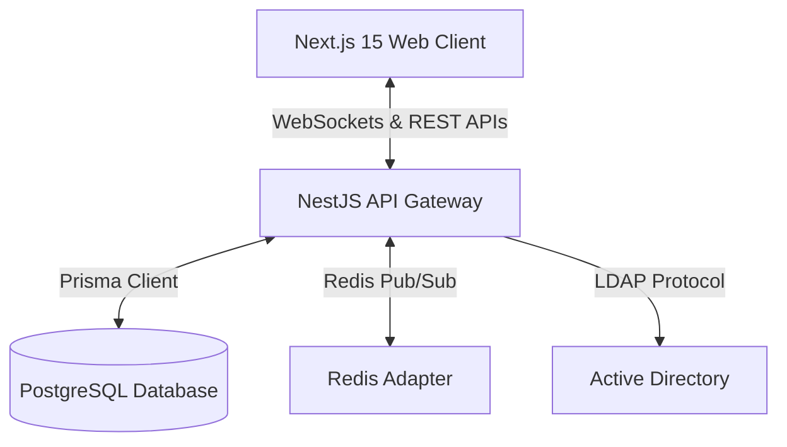

# Warehouse Queue Management System (WQMS)

[](https://nestjs.com/)
[](https://nextjs.org/)
[](https://www.prisma.io/)
[](https://redis.io/)
[](https://www.postgresql.org/)

A real-time, multi-tenant enterprise platform designed to optimize warehouse loading/unloading dock schedules, manage carrier queues, and eliminate truck congestion.

---

## 💼 Business Value & Real-World Impact

In large-scale logistics operations, unscheduled truck arrivals cause severe queue bottlenecks, high demurrage costs, and warehouse staff inefficiencies. **WQMS** directly addresses these challenges by:
* **Reducing Congestion**: Enabling vendors/drivers to pre-book specific time slots based on dock compatibility and vehicle unloading times.
* **Maximizing Dock Utilization**: Real-time Gantt/Board reschedule tools allow dispatchers to instantly adjust queues dynamically via drag-and-drop.
* **Enterprise Security Integration**: Syncs authentication seamlessly with client internal networks through Active Directory (LDAP).
* **Automated Audit Trail**: Logs every single queue transition for billing, SLA analysis, and disputes.

---

## 🛠️ Tech Stack & Architecture



### Backend
* **NestJS (V11)**: Structured modular backend framework.
* **Prisma ORM**: Type-safe database queries.
* **Socket.io + Redis Adapter**: Real-time pub-sub system for clustering support.
* **Winston Logger**: Enterprise grade structured logs.
* **LDAP JS Client**: Active Directory authorization flow.

### Frontend
* **Next.js 15 (App Router & Turbopack)**: Fast React framework with server/client components.
* **React Query (TanStack)**: Advanced client-side caching & state sync.
* **Radix UI & Tailwind CSS**: Accessible, premium styled components.
* **DND Kit**: Smooth, accessible drag-and-drop dashboard queue reordering.
* **Playwright**: End-to-end testing suite.

---

## 🚀 Key Features & Algorithms

### 1. Auto-Efficiency Booking Validator
Before allowing any booking or modification, the backend executes a strict validation algorithm (`justifyBooking`):
* **Dock Capacity Check**: Ensures vehicle type (e.g., Container, Wingbox, CDD) matches the allowed dock gates.
* **Dock Busy Times**: Filters out unavailable times (e.g., lunch breaks, maintenance) supporting complex recurrence patterns (Daily, Weekly, Monthly).
* **Real-time Overlap Prevention**: Checks existing schedules to prevent double bookings.
* **Buffer Enforcement**: Auto-injects mandatory minimum buffer intervals between truck slots.

### 2. Live Gantt / Queue Board (Drag & Drop)
The admin board uses `DND Kit` to move bookings between docks or status lists. Moving a item triggers:
* **Slot Fit Recalculation**: Backend evaluates position, shifts adjacent queues, or performs atomic **SWAP** operations if durations match.
* **WebSocket Propagation**: Broadcasters push the update immediately to all connected warehouse monitors.

### 3. Active Directory Multitenancy
Each Tenant (Organization) can enable separate domain LDAP settings:
```ini
AD_HOST="ldap://domain.com"
AD_PORT=389
AD_DOMAIN="domain\\user"
AD_BASE_DN="OU=Users,DC=domain,DC=com"
```
Users authenticate using internal enterprise accounts, falling back to local credentials for vendor accounts.

### 4. Real-time Driver-Warehouse Chat
Drivers and warehouse dispatchers can open persistent, authenticated rooms to coordinate unloading times, updates, or gate changes.

---

## 📡 WebSocket API

WQMS relies on WebSockets for zero-latency screen updates.

### Booking Namespace Gateway
| Event Name | Type | Payload | Description |
|---|---|---|---|
| `join_warehouse` | Sub | `{ warehouseId: string }` | Joins a room to receive real-time queue board updates. |
| `leave_warehouse` | Sub | `{ warehouseId: string }` | Leaves a warehouse board updates room. |
| `join_booking` | Sub | `{ bookingId: string }` | Subscribes to updates on a specific truck booking. |
| `semi-detail-list` | Pub | None | Dispatched by server when board lists update. |
| `find-all` | Pub | None | Dispatched by server when complete database records sync. |

---

## 🗄️ Database Schema Highlight
The system model centers on PostgreSQL:
* **Organization**: Tenant configs & LDAP settings.
* **Warehouse**: Dock associations, delay tolerance, and auto-efficiency settings.
* **Dock**: Dock-specific rules, allowed vehicles, and priority indexes.
* **Booking**: Current queue status (`PENDING`, `IN_PROGRESS`, `UNLOADING`, `FINISHED`, `CANCELED`), estimated schedules, and driver assignments.
* **MoveTrace**: Audit logger tracking every status transition along with the username who performed the action.

---

## ⚙️ Local Development Setup

### Backend Setup
1. Navigate to the backend directory:
   ```bash
   cd backend
   ```
2. Copy the environment file template and configure it:
   ```bash
   cp .env.example .env
   ```
3. Install dependencies:
   ```bash
   pnpm install
   ```
4. Run Prisma database migrations & seed:
   ```bash
   npx prisma migrate dev
   pnpm run db:formatAll-seed-studio
   ```
5. Start in watch mode:
   ```bash
   pnpm run dev
   ```

### Frontend Setup
1. Navigate to the frontend directory:
   ```bash
   cd ../frontend
   ```
2. Copy the environment template:
   ```bash
   cp .env.example .env.local
   ```
3. Install dependencies:
   ```bash
   pnpm install
   ```
4. Start the next dev server:
   ```bash
   pnpm run dev
   ```

---

## 🧪 Testing
Run end-to-end tests inside the frontend directory:
```bash
npx playwright test
```
